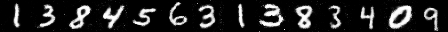

## Conditional GAN生成数字图像

### 简介
本项目包含了第三届计图人工智能挑战赛 - 热身赛的代码实现。本项目根据提供的数字图片数据集 MNIST，训练了一个将随机噪声和类别标签映射为数字图片的Conditional GAN模型，并生成了比赛页面指定数字序列`13845631383409`。

### 运行环境
* Windows 10 
* python >= 3.8 
* jittor >= 1.3.7

### 运行方法
```
python CGAN.py
```

### 结果展示


### 参考文献
此项目基于论文 Conditional Generative Adversarial Nets 实现，部分代码参考参考了框架代码 [jittor-gan](https://data.educoder.net/api/attachments/5149654)。